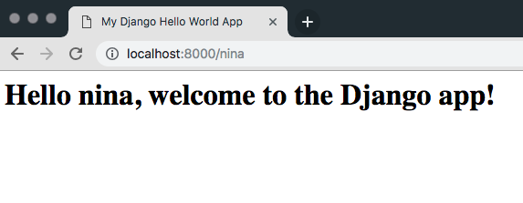

# Barebones Hello World Django App

This is a bare-bones Django Hello World app.

It looks like:

It contains two routes:

1. `/` will display a default "Hello World" message. Locally this route is accessible via [http://127.0.0.1:8000/](http://127.0.0.1:8000/)
1. `/name` will display a "Hello, `name`" message. Locally this route is accessible via [http://127.0.0.1:8000/name](http://127.0.0.1:8000/name)

## Installation instructions

1. Create a new `python3` virtual environment:
`python3 -m venv env`
1. Activate it:
`source env/bin/activate`
1. Install requirements:
`pip install -r requirements.txt`
1. Run the server, like this:
`python manage.py runserver`

Locally, access the app via either of the following urls:

 - [http://127.0.0.1:8000/](http://127.0.0.1:8000/)
 - [http://127.0.0.1:8000/name](http://127.0.0.1:8000/name)
